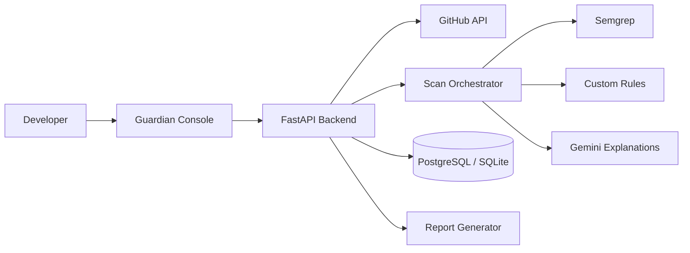

# CodeGuardian 🛡️
### Explainable AI Security Reviews for GitHub Pull Requests

[](https://github.com/guardian-security/codeguardian/actions/workflows/tests.yml)
[](https://opensource.org/licenses/MIT)
[](https://owasp.org)
[](https://www.python.org/)
[](https://react.dev/)

CodeGuardian is a developer-first security review cockpit that combines **deterministic static code analysis (Semgrep + 15 custom Python AST rules)** with **Google Gemini explainable AI (`google-genai`)** to deliver transparent, reproducible, and verifiable pull-request audits.

---

## 1. Problem Statement

Traditional Static Application Security Testing (SAST) tools generate overwhelming volumes of noisy alerts with opaque severity scores and no actionable remediation context. Conversely, purely generative AI bots hallucinate vulnerabilities, leak sensitive secrets to external endpoints, and lack deterministic ground truth.

**CodeGuardian bridges this gap**:
- **Ground Truth First**: Scanner findings are detected deterministically via Semgrep, AST parsers, and dependency inspectors.
- **Explainable Rationale**: Google Gemini synthesizes structured, validated JSON explanations: *Why Flagged*, *Attack Scenario*, and *Suggested Patch*.
- **Secret Redaction Guard**: High-entropy keys, passwords, and private tokens are masked prior to AI dispatch or database persistence.
- **Human-in-the-Loop**: Developers retain complete review authority; automated unconfirmed GitHub comments are strictly disabled.

---

## 2. System Architecture



### Data Flow Pipeline
1. **Pull Request Ingestion**: The backend validates and parses the GitHub PR URL, retrieving changed files and unified diffs.
2. **Static & AST Analysis**: Runs Semgrep ruleset `p/default` and 15 custom security rules.
3. **Supply Chain Inspection**: Analyzes `requirements.txt`, `package.json`, and lockfiles for OWASP **A03:2025** supply-chain posture.
4. **Finding Deduplication**: Consolidates overlapping detections by `(file_path, line_start, CWE)` and merges sources (`semgrep+custom_rule`).
5. **OWASP Top 10:2025 Mapping**: Resolves CWEs using the versioned `owasp_2025.json` file.
6. **Secret Redaction**: Masks AWS keys, GitHub PATs, JWTs, and passwords.
7. **Explainable AI Synthesis**: Dispatches windowed code context to Gemini using Pydantic JSON schemas.
8. **Transparent Risk Scoring**: Calculates deterministic 0–100 risk score and serves the interactive Guardian Console.

---

## 3. Technology Stack

- **Frontend**: React 18, Vite, TypeScript, Tailwind CSS, Recharts, Lucide React, Framer Motion.
- **Backend**: Python 3.11+, FastAPI, SQLAlchemy, Pydantic v2, httpx, Alembic.
- **Database**: SQLite (default local development) / PostgreSQL 15 (Docker & production).
- **Security Engine**: Semgrep CLI, 15-rule custom Python AST engine, supply-chain inspector.
- **AI Engine**: Google Gemini API (`google-genai` SDK) with structured JSON schemas and offline demo fallback.
- **DevOps**: Docker, Docker Compose, GitHub Actions, Makefile.

---

## 4. Key Features

- **The Guardian Console**: Dark obsidian / electric cyan developer cockpit with accessible alternatives for all visualizations.
- **Security Pulse Header**: Real-time scan state, animated pulse indicator, PR metadata, and active stage progression.
- **Threat Replay Mode**: Visual step-by-step playback of finding discoveries with Play, Pause, and Skip controls.
- **Interactive Risk Matrix**: 2D scatter matrix (Exploitability vs. Impact) with confidence-weighted interactive bubbles.
- **Code Heatmap & Hotspots**: File tree displaying vulnerability density, lines changed, and file risk scores.
- **Risk Constellation Graph**: Orbital node network displaying inter-file connections and OWASP color families.
- **6-Stage AI Reasoning Trail**: Explicit transparent breakdown (*Evidence &rarr; Why Flagged &rarr; Attack Scenario &rarr; Impact &rarr; Patched Code &rarr; Human Verification Requirement*).
- **Offline Demo Mode**: Pre-packaged synthetic review (PR #42, 11 findings across SQLi, hardcoded credentials, unsafe shell, weak hashing, CORS, and supply-chain gaps) requiring zero API keys.
- **Standalone HTML Report**: Printable, downloadable executive security report featuring the mandatory human audit disclaimer.

---

## 5. Getting Started

### Prerequisites
- Python 3.11+
- Node.js 18+ & npm
- (Optional) Docker & Docker Compose
- (Optional) Semgrep CLI (`pip install semgrep`)

### Local Setup (Without Docker)

1. **Clone the repository**:
   ```bash
   git clone https://github.com/guardian-security/codeguardian.git
   cd codeguardian
   ```

2. **Backend Setup**:
   ```bash
   cd backend
   pip install -r requirements.txt
   cp ../.env.example .env
   # Start backend API on port 8000
   python -m uvicorn app.main:app --reload --port 8000
   ```

3. **Frontend Setup** (in a separate terminal):
   ```bash
   cd frontend
   npm install
   # Start Vite dev server on port 5173
   npm run dev
   ```

4. **Access Guardian Console**:
   Open [http://localhost:5173](http://localhost:5173) in your browser.

---

## 6. Environment Variables

Configure `.env` in the `backend/` directory:

| Variable | Description | Default |
|---|---|---|
| `DATABASE_URL` | SQLAlchemy connection string | `sqlite:///./codeguardian.db` |
| `GEMINI_API_KEY` | Google Gemini API Key | *(Optional; offline demo provider used if absent)* |
| `GEMINI_MODEL` | Gemini Model identifier | `gemini-2.5-flash` |
| `GITHUB_TOKEN` | GitHub Personal Access Token | *(Optional; prevents public rate limits)* |
| `ENABLE_GITHUB_COMMENTS` | Guardrail for inline comments | `false` |
| `OWASP_VERSION` | Standard version alignment | `2025` |
| `MAX_FILE_SIZE_BYTES` | File ingestion limit | `500000` (500 KB) |
| `MAX_CHANGED_FILES` | Max files analyzed per PR | `50` |
| `SEMGREP_TIMEOUT_SECONDS` | Semgrep subprocess timeout | `25` |

---

## 7. Running Tests

### Backend Test Suite (Pytest)
```bash
cd backend
python -m pytest tests -v
```
*Includes 22 comprehensive test suites covering custom rules, secret redaction, mathematical risk formulas, Gemini schema validation, finding deduplication, dependency analysis, path traversal protection, scanner timeouts, and prompt-injection resistance.*

### Frontend Build & Typecheck
```bash
cd frontend
npm run build
```

---

## 8. Docker Deployment

Deploy the complete multi-tier stack (PostgreSQL + FastAPI + Nginx Frontend) with one command:

```bash
docker-compose up --build -d
```
- Guardian Console: [http://localhost](http://localhost)
- Backend API Docs: [http://localhost:8000/docs](http://localhost:8000/docs)

To shut down:
```bash
docker-compose down
```

---

## 9. Security Limitations & Governance

> [!WARNING]
> **Automated Aid Notice**: CodeGuardian is an automated security review aid and does **not** constitute a formal or complete security audit. Human architectural review and manual penetration testing remain indispensable.

- **No Code Execution**: CodeGuardian analyzes code strictly as passive text/AST; no untrusted repository code or install scripts are ever executed.
- **No Unconfirmed Comments**: Inline review comments on GitHub pull requests require explicit server-side enablement (`ENABLE_GITHUB_COMMENTS=true`) and individual confirmation payloads.
- **Prompt Injection Defense**: Untrusted code comments requesting that the auditor ignore vulnerabilities are isolated and cannot suppress deterministic detections.

---

## 10. License

This project is licensed under the [MIT License](LICENSE).
