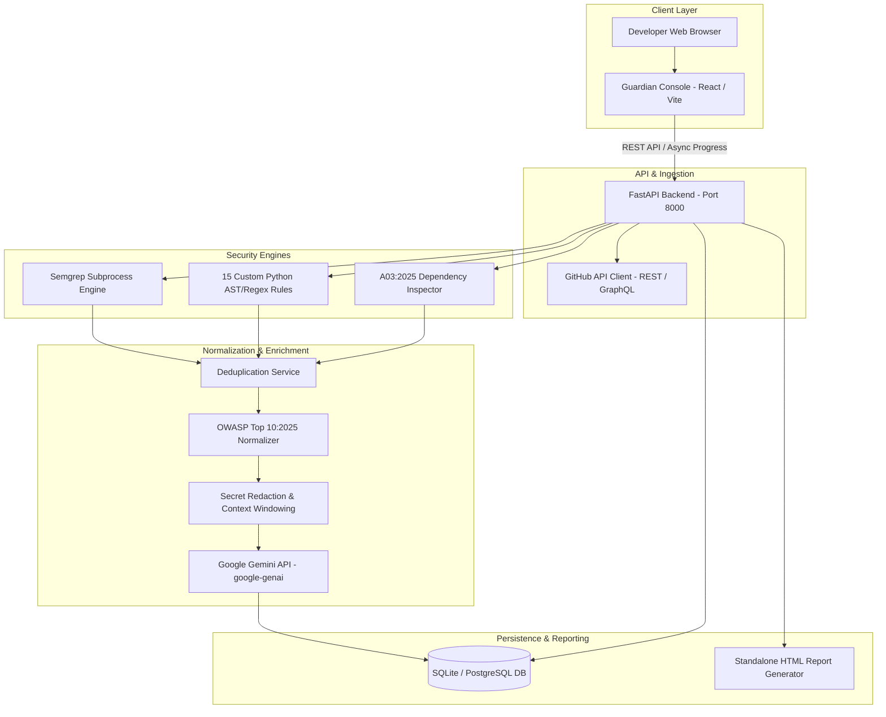

# CodeGuardian — Technical Architecture

CodeGuardian is an explainable AI security review platform designed for GitHub Pull Requests. It orchestrates static analysis, custom AST rules, software supply-chain inspections, deterministic risk calculations, and Google Gemini explainable AI enrichments.

## System Topology

## Data Lifecycle & Decoupling

1. **Deterministic Finding Identification**:
   - Static analysis outputs raw patterns from Semgrep CLI and custom AST rules.
   - Findings are deduplicated based on `(file_path, line_start, CWE)`.
   - Overlapping detections combine sources (e.g. `source: "semgrep+custom_rule"`).
2. **Secret Masking**:
   - `SecretRedactionService` evaluates tokens, AWS keys, passwords, and private keys via regex before code reaches external APIs or UI displays.
3. **Structured AI Enrichment**:
   - Decoupled `AIExplanation` objects are synthesized by Gemini using Pydantic JSON schemas.
   - Telemetry tracks `input_tokens`, `output_tokens`, `latency_ms`, and `provider_status`.
   - Deterministic findings remain accessible even if AI synthesis is unavailable.
4. **Transparent Risk Scoring**:
   - Score formula: `risk_score = (severity * 0.40 + confidence * 0.25 + exploitability * 0.20 + exposure * 0.15) * 100`.
   - Aggregate scan score factors highest individual risks and critical severity counts.
